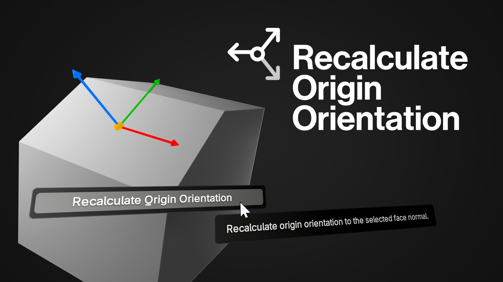

#  Additional Batch Rename

A simple Blender add-on that recalculates an object's origin based on the selected face normal in Edit Mode
  
# How to Use

First, select the object you want to recalculate and enter Edit Mode. Select the face you wish to orient as the origin and right-click, then select the "Recalculate Origin Orientation" option from the menu.

Here's a showcase of the add-on:

https://github.com/user-attachments/assets/861bbf81-4afb-48c7-902c-6ebbcb78512a

# Note

Since the add-on only reorients the origin and doesn't transform it. You should change the origin position separately, either before or after recalculating the orientation.
